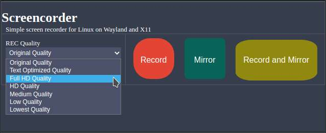
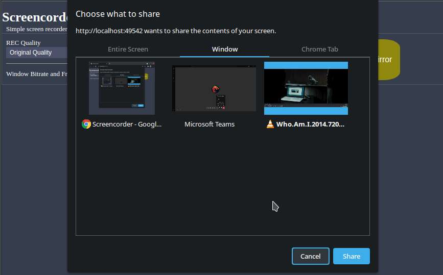
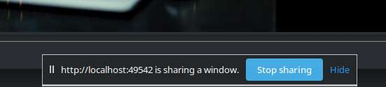

# Screencorder
## Screen recorder for linux on Wayland and X11 
### Simple, fast and open-source with GUI 





# Installation

## 1. Make sure you have required dependencies 
`pulseaudio-utils lame mpg123 ffmpeg`
```
# Example : On debian/ubuntu
sudo apt-get install pulseaudio-utils lame mpg123 ffmpeg
```


## 2. Download
You can also `git clone` it for easy updates. 
`Total Size ~6 MB` 

Download the first one (x64) if you are not sure.

| Platform | Download zip | git clone |
| :--------: | :---------------: | :--------------- |
| **x64** | [**Download**](https://github.com/HasinduLanka/screencorder/archive/refs/heads/linux.amd64.zip) | `git clone --depth=1 --branch=linux.amd64 --single-branch https://github.com/HasinduLanka/screencorder` |
| x86 | [Download](https://github.com/HasinduLanka/screencorder/archive/refs/heads/linux.x86.zip) | `git clone --depth=1 --branch=linux.x86 --single-branch https://github.com/HasinduLanka/screencorder` |
| ARM64 | [Download](https://github.com/HasinduLanka/screencorder/archive/refs/heads/linux.arm64.zip) | `git clone --depth=1 --branch=linux.arm64 --single-branch https://github.com/HasinduLanka/screencorder` |
| ARM | [Download](https://github.com/HasinduLanka/screencorder/archive/refs/heads/linux.arm.zip) | `git clone --depth=1 --branch=linux.arm --single-branch https://github.com/HasinduLanka/screencorder` |

## 3. Unzip it
 where you want to store recordings


# Usage

## 1. Run `screencorder`
Example:  `./screencorder`

**If your device has more than one audio output**, you will be asked to select
```
Multiple sound devices detected. Which one to use?
        [0] = combined
        [1] = alsa_output.analog-stereo
Enter [value] : 0
```

A browser will open. If not, open a browser and go to http://localhost:49542/

While screencorder *should* work on all major browsers, we recommend to use a chromium based browser like **Brave or Google Chrome**.

## 2. Select a recording quality
Default is original

| Quality | Bitrate | FPS |
| :-------: | :-------: | :---: |
| Original | Window bitrate | Screen Refresh rate |
| Full HD | 8 Mbps | 60 |
| HD | 5 Mbps | 30 |
| Medium | 2.5 Mbps | 30 |
| Low | 1 Mbps | 24 |
| Lowest | 0.6 Mbps | 16 |
| Text Optimized | Window bitrate | 10 |


These can vary according to your screen configs. File size depends on what you are recording.

Audio will be recorded @ `128 kbps`


## 3. Click `Start`
Share your window or desktop.



On **wayland** you will only be able to share windows. Not desktops.

## 4. Click `Stop Sharing` button
 from browser toolbar or the floating menu. It may be minimized.



## 5. See your recordings from `$Home/Videos/screencorder` folder 
Open your user home folder -> Videos -> screencorder
Recorded file type is `MKV`
You can safely stop `screencorder` now


```
⭐⭐⭐ Start this repo up there ⭐⭐⭐
```


# How this screen recorder works on wayland
Most screen recorders out there do not work on wayland. Why?
Because wayland is much secure than old X11. Wayland doesn't let every program to see what others doing. It's a bit harder to gain access.

But web browsers, like Chromium have handled these security features properly. That's why we use a *local Progressive Web App* as the frontend and a backend written in Go. The **PWA records the screen** and sends them to the backend as blobs. **Backend records system sounds** and combines all together in realtime.


# Contributions
Join us with code. Any new features and changes are welcome!
This is a small project. You can get your head around easily. 

# Copyleft
This project has been **copyleft** by Hasindu Lanka and Harindu Wijesinghe of **Bitblazers**, Sri Lanka.

What that means?
It means you can use this for any non-commercial, commercial applience ; copy, distribute and rebrand for free. But when you copy, distribute or rebrand, that product must also be free, **opensource** and **copyleft**.

Just be kind to inform us what great thing you made using this. We won't ask for money :-) 


# --------------------------------------------
# Possible Search querries

# Screen recorder for wayland
# Screen recorder for x11
# Screen recorder for linux
# Screen recorder for kde
# Screen recorder for gnome
# Screen recorder for ubuntu
# Screen recorder for kubuntu
# record screen 21.04
# record screen wayland
# sreen cast linux
# sreen cast wayland
# record window linux
# my screen recorder not working on wayland
# my screen recorder not working after 21.04 update
# screen record black, blank
# vokoscreen not working crashes
# simplescreenrecorder not working
# download screen window cast recorder for wayland ubuntu debain

# --------------------------------------------
